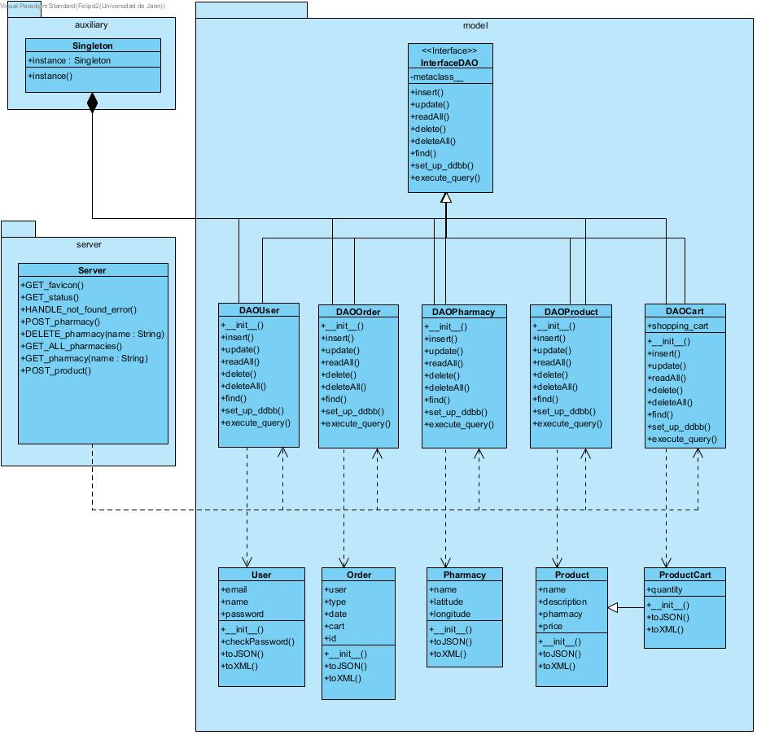

# Pharmacy managing project

This repository corresponds to the server of the project.

The mobile app that connects to it can be seen on the [@xenahort's repository](https://github.com/xenahort/Aplicacion_Android_maps_receptiva_y_adaptable).

## Deploy URL

The server is automatically deployed in the following URL after each commit on GitHub.

https://dss-pharmacy.herokuapp.com/

## Deploy locally

If the server is down or you choose to deploy the project locally,

* Clone the repository and move to the root directory
* Execute `pip3 install -r requirements.txt`
* Execute `python3 src/server/server.py`
* Go to `localhost:80`

Bear in mind that you have to change the variable `debug` on each HTML page from `false` to `true`.

## Documentation

Basically, the server will return JSON messages under HTTP petitions on the `/rest/$(resource)` route, being those resources.

* Orders
* Pharmacies
* Products
* Users
* Shopping cart

Further documentation can be seen [on the following link](doc/).

### Persistance

The persistance of the project is made using MySQL on the PaaS [ClearDB](https://www.cleardb.com/).

### Diagrams

